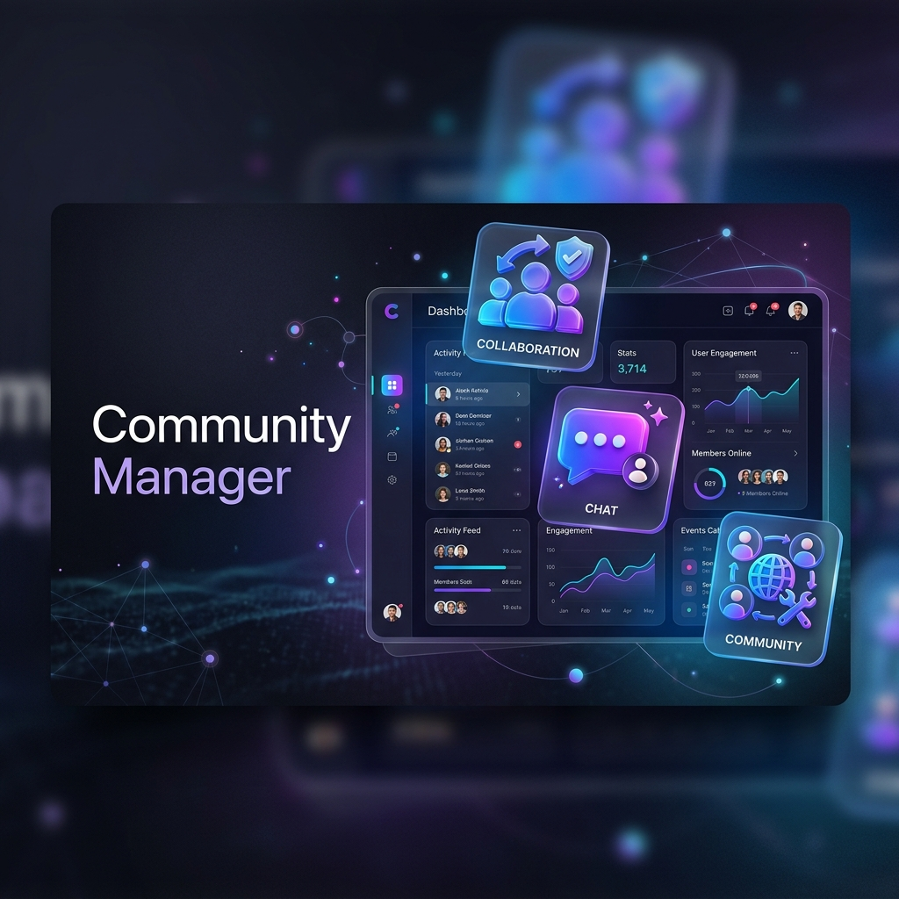

# 🏘️ Community Manager



> **A premium, high-performance community orchestration engine designed for seamless collaboration, robust administration, and real-time connectivity.**

[](https://nodejs.org/)
[](https://expressjs.com/)
[](https://www.mongodb.com/)
[](https://getbootstrap.com/)
[](https://opensource.org/licenses/ISC)

---

## 🌟 Vision

Community Manager is more than just a registry; it is a **centralized ecosystem** built to empower communities. By bridging the gap between administrators and residents, it fosters a transparent, engaged, and efficient living environment through technology.

---

## 🚀 Key Features

### 👥 Intellectual Member Orchestration
- **Dynamic Role Management:** Intelligent differentiation between community owners and residents for a tailored user experience.
- **Unified Profiles:** Secure management of personal and contact information with granular control.
- **Effortless Curation:** Streamlined tools for tracking and organizing community members.

### 📢 Real-time Communication Suite
- **Alert Box (Community Chat):** An integrated, low-latency communication channel for instant resident collaboration.
- **Instant Broadcasts:** Push critical announcements and community alerts in real-time.
- **Sentiment & Feedback:** A robust review system allowing residents to provide actionable feedback.

### 💼 Operational Excellence
- **Rent & Financial Tracking:** A modern ledger system for managing and tracking community financial obligations.
- **Admin Dashboard:** Powerful tools for content curation, member verification, and system updates.
- **Hardened Security:** State-of-the-art authentication flow powered by Passport.js with secure session management.

---

## 🖼️ Gallery

<div align="center">
  
  
</div>
<br/>
<div align="center">
  
  
</div>

---

## 🛠️ Technical Architecture

### Core Stack
| Layer | Technologies |
| :--- | :--- |
| **Frontend** | EJS Templates, Bootstrap 5, Custom CSS3 |
| **Backend** | Node.js, Express.js Framework |
| **Database** | MongoDB with Mongoose ODM |
| **Security** | Passport.js, Express-Session, BCrypt |
| **Utilities** | Connect-Flash, Method-Override, Dotenv |

### Project Structure
```bash
.
├── models/         # Data schemas for Users, Rent, and Reviews
├── public/         # High-resolution assets, styles, and scripts
├── views/          # Dynamic EJS templates and modular layouts
├── middleware.js   # Advanced authentication and authorization logic
├── app.js          # Main entry point and server configuration
└── .env.example    # Configuration template for deployment
```

---

## 🏁 Getting Started

### Prerequisites
- **Node.js**: Environment version 16.x or higher
- **MongoDB**: A local instance or a remote Atlas connection URI
- **NPM**: Package manager (included with Node.js)

### Installation Sequence

1. **Clone & Enter Registry:**
   ```bash
   git clone https://github.com/pvishalkeerthan/Community_Manager.git
   cd Community_Manager
   ```

2. **Dependency Bootstrapping:**
   ```bash
   npm install
   ```

3. **Environment Calibration:**
   Duplicate the template and inject your credentials:
   ```bash
   cp .env.example .env
   # Edit .env with your MONGO_URL and SESSION_SECRET
   ```

### Execution

- **Development Mode** (Hot-reloading enabled):
  ```bash
  npm run dev
  ```
- **Production Deployment**:
  ```bash
  npm start
  ```

Once running, access the portal at [http://localhost:3000](http://localhost:3000).

---

## 🤝 Contribution Gateway

We believe in the power of open communities. To contribute:
1. **Fork** the repository.
2. **Create** a descriptive feature branch.
3. **Commit** your changes with clear logic.
4. **Push** and initiate a **Pull Request**.

---

## 📜 License

Project distributed under the **ISC License**. Reference `LICENSE` for comprehensive legal terms.

---

<p align="center">
  <b>Built for the future of community living.</b><br/>
  <sub>Created with ❤️ for better, more connected communities.</sub>
</p>
